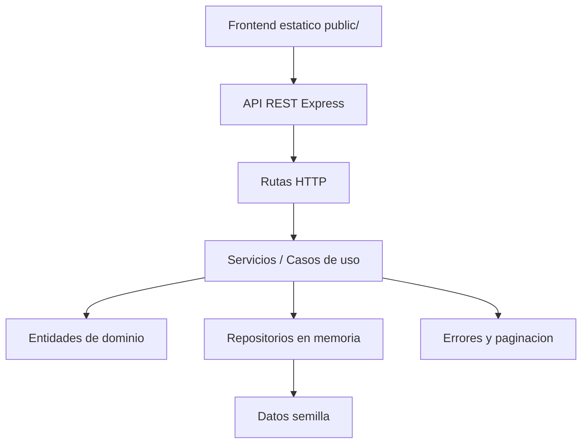
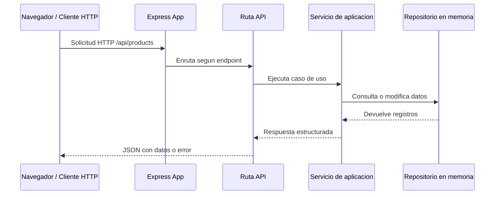
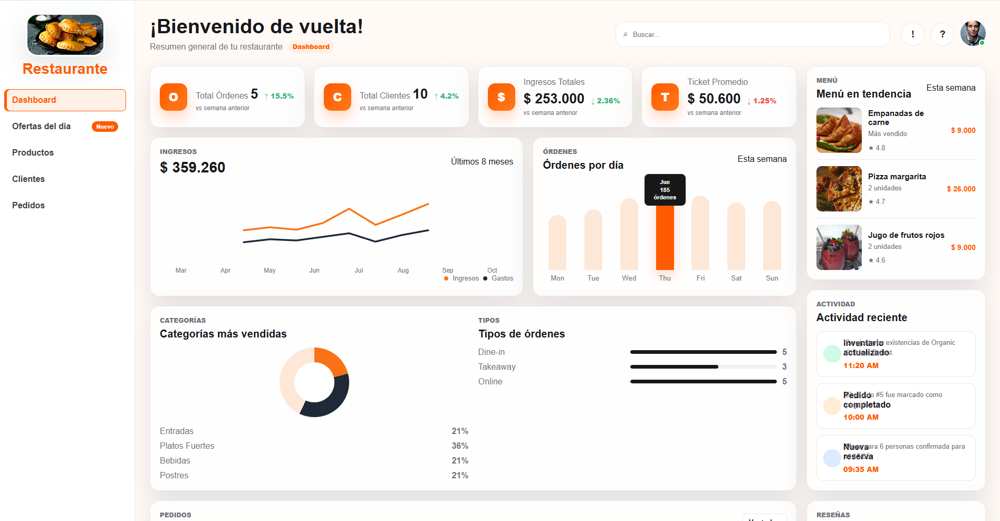

# Documentacion Tecnica - Sistema Integral de Gestion de Restaurante (SIGR)

## 1. Informacion General

**Nombre del proyecto:** Sistema Integral de Gestion de Restaurante (SIGR)  
**Tipo de sistema:** Aplicacion web con API REST y frontend estatico  
**Version:** Linea base 1.0.0  
**Fecha de referencia:** 10/05/2026  
**Repositorio:** `TallerRestaurante`

SIGR es una linea base academica para la gestion basica de un restaurante. El sistema permite demostrar operaciones de autenticacion, gestion de usuarios, categorias, productos, reservas, pedidos, pagos, caja, reportes y dashboard administrativo.

La aplicacion combina una API construida con Node.js y Express.js, una interfaz web estatica ubicada en `public/`, pruebas automatizadas con Jest y Supertest, y datos semilla en memoria para facilitar la ejecucion local y el despliegue academico.

## 2. Objetivo del Documento

Este documento describe la estructura tecnica del proyecto, la arquitectura utilizada, los componentes principales del codigo, la organizacion de carpetas, el flujo general del sistema, los endpoints disponibles y las evidencias visuales de la interfaz.

## 3. Stack Tecnologico

- **Node.js:** entorno de ejecucion JavaScript del backend.
- **Express.js:** framework HTTP para exponer la API REST y servir archivos estaticos.
- **CORS:** middleware para permitir consumo de la API desde clientes web.
- **Jest:** framework de pruebas automatizadas.
- **Supertest:** libreria para probar endpoints HTTP de Express.
- **HTML, CSS y JavaScript vanilla:** interfaz web administrativa sin framework frontend.
- **Repositorios en memoria:** persistencia temporal para demo y pruebas.
- **Vercel:** configuracion incluida para despliegue serverless.

## 4. Estructura del Proyecto

```text
TallerRestaurante/
  docs/
    assets/
    linea-base.md
    documentacion-tecnica.md
  public/
    assets/
    index.html
    styles.css
    app.js
  scripts/
    generate_linea_base_pdf.py
  src/
    application/
      use-cases/
    domain/
      entities/
    infrastructure/
      database/
      http/
      repositories/
    shared/
      errors/
      pagination/
  tests/
    api.test.js
  package.json
  README.md
  vercel.json
```

### Descripcion de carpetas

- `src/domain/entities/`: contiene las entidades del negocio y sus validaciones principales.
- `src/application/use-cases/`: contiene los servicios de aplicacion que implementan los casos de uso.
- `src/infrastructure/http/`: contiene la app Express, rutas, middlewares y manejo de errores HTTP.
- `src/infrastructure/database/`: contiene el contenedor de dependencias y los datos iniciales.
- `src/infrastructure/repositories/`: contiene el repositorio en memoria.
- `src/shared/`: utilidades reutilizables, como paginacion y errores de aplicacion.
- `public/`: interfaz web estatica que consume la API REST.
- `tests/`: pruebas de integracion de la API.
- `docs/`: documentacion y evidencias graficas.
- `scripts/`: utilidades para generar documentos de entrega.

## 5. Arquitectura Utilizada

El proyecto usa una **arquitectura por capas**, inspirada en una separacion limpia entre dominio, aplicacion e infraestructura. Esta organizacion facilita mantener el codigo ordenado, probar la logica y reemplazar componentes en el futuro, por ejemplo cambiar los repositorios en memoria por una base de datos real.



### Capa de dominio

La capa de dominio esta ubicada en `src/domain/entities/`. Define las reglas basicas de cada entidad:

- `User.js`: valida nombre, correo, contrasena y roles permitidos.
- `Category.js`: valida el nombre de la categoria.
- `Product.js`: valida categoria, nombre y precio mayor que cero.
- `Order.js`: valida cliente, items, estados permitidos y calcula subtotales y total.
- `Payment.js`: valida pedido, monto y metodo de pago.
- `Reservation.js`: valida cliente, telefono, fecha, hora, numero de personas y estado.

Esta capa no depende de Express ni de detalles de infraestructura.

### Capa de aplicacion

La capa de aplicacion esta en `src/application/use-cases/`. Aqui se coordinan los casos de uso del sistema:

- `AuthService.js`: autentica usuarios de prueba y devuelve un token demo.
- `CrudService.js`: implementa operaciones genericas de listar, consultar, crear, modificar y eliminar.
- `OrderService.js`: gestiona pedidos maestro-detalle, valida cliente y productos, enriquece pedidos con datos de cliente y producto.
- `PaymentService.js`: registra pagos y cambia el estado del pedido a `pagado`.
- `ReportService.js`: genera reportes de ventas diarias, pedidos por estado y productos mas vendidos.
- `DashboardService.js`: calcula metricas y analitica para el dashboard administrativo.

### Capa de infraestructura

La capa de infraestructura integra el sistema con tecnologias concretas:

- `src/infrastructure/http/app.js`: crea la aplicacion Express, configura CORS, JSON, archivos estaticos, rutas API y errores.
- `src/infrastructure/http/routes/index.js`: define los endpoints REST principales.
- `src/infrastructure/http/routes/crudRoutes.js`: reutiliza rutas CRUD para usuarios, categorias, productos y reservas.
- `src/infrastructure/http/middlewares/`: contiene middlewares para manejo asincrono, validacion de campos obligatorios y errores.
- `src/infrastructure/repositories/InMemoryRepository.js`: repositorio generico basado en `Map`.
- `src/infrastructure/database/container.js`: construye repositorios, servicios y carga datos iniciales.
- `src/infrastructure/database/seedData.js`: datos demo de usuarios, productos, pedidos, pagos y reservas.

### Capa compartida

La carpeta `src/shared/` contiene elementos reutilizables:

- `AppError.js`: error personalizado con codigo HTTP.
- `paginate.js`: calcula paginacion y estructura respuestas paginadas.

## 6. Flujo General de una Peticion



Ejemplo: al consultar productos desde la interfaz, `public/app.js` hace una llamada a `/api/products?page=1&limit=6`. Express recibe la peticion, la ruta invoca `CrudService`, el servicio consulta `InMemoryRepository` y la respuesta vuelve al frontend con `data` y `meta` de paginacion.

## 7. Explicacion Breve del Codigo

### Entrada del servidor

`src/server.js` importa `createApp()`, define el puerto y levanta el servidor cuando el archivo se ejecuta directamente con `npm start`. Tambien exporta la app para pruebas y despliegue.

### Creacion de la app

`src/infrastructure/http/app.js` centraliza la configuracion HTTP:

- Habilita CORS.
- Habilita lectura de JSON.
- Sirve el frontend desde `public/`.
- Monta la API bajo `/api`.
- Maneja rutas no encontradas.
- Registra el middleware global de errores.

### Rutas

`src/infrastructure/http/routes/index.js` expone endpoints como:

- `GET /api/health`
- `POST /api/auth/login`
- `GET /api/users`
- `GET /api/products`
- `POST /api/orders`
- `GET /api/orders/:id`
- `POST /api/payments`
- `GET /api/reports/daily-sales`
- `GET /api/dashboard/analytics`

Los modulos CRUD reutilizan `createCrudRouter()` para reducir duplicacion en recursos simples.

### Servicios

Los servicios contienen la logica principal. Por ejemplo, `OrderService.create()` valida que el cliente exista, revisa que cada producto exista y este disponible, calcula precios unitarios y crea el pedido con sus items. Luego `OrderService.enrich()` agrega informacion del cliente y productos para que el frontend no reciba solo identificadores.

### Repositorio en memoria

`InMemoryRepository.js` usa un `Map` para guardar registros durante la ejecucion del servidor. Incluye metodos de creacion, busqueda, actualizacion, eliminacion, listado completo y paginacion.

Esta decision permite que el proyecto funcione sin instalar una base de datos. La limitacion es que los datos se reinician cuando se reinicia el proceso.

### Frontend

La interfaz esta compuesta por:

- `public/index.html`: estructura base, sidebar, barra superior, contenedores de vista, drawer y modal.
- `public/styles.css`: estilos visuales, layout responsive, cards, tablas, dashboard, modales y drawer.
- `public/app.js`: logica del cliente, consumo de API, renderizado de dashboard, productos, clientes, ofertas y pedidos.

El frontend usa JavaScript vanilla y renderiza vistas segun el estado local:

- `dashboard`
- `offers`
- `products`
- `customers`
- `orders`

## 8. Modulos Funcionales

### Autenticacion

Permite iniciar sesion con usuarios demo. El token generado es simbolico y sirve para la linea base academica.

### Usuarios y clientes

Permite listar usuarios, filtrar clientes por rol, crear clientes y modificarlos desde la interfaz.

### Categorias y productos

Permite gestionar categorias y productos. Los productos incluyen nombre, descripcion, precio, disponibilidad e imagen.

### Pedidos maestro-detalle

Cada pedido contiene un encabezado con cliente, mesa, estado, total y fecha. Tambien contiene un detalle con items, cantidades, precios unitarios y subtotales.

### Pagos y caja

El sistema registra pagos asociados a pedidos. Al registrar un pago, el pedido cambia a estado `pagado`. Los reportes de caja permiten consultar ventas diarias.

### Reportes

Incluye ventas diarias, pedidos por estado y productos mas vendidos.

### Dashboard administrativo

Muestra indicadores de ordenes, clientes, ingresos, ticket promedio, graficas, categorias, tipos de orden, actividad reciente, resenas y menu en tendencia.

## 9. Endpoints Principales

| Metodo | Endpoint | Descripcion |
| --- | --- | --- |
| GET | `/api/health` | Verifica estado del servicio |
| POST | `/api/auth/login` | Autentica usuario demo |
| GET | `/api/users` | Lista usuarios con paginacion |
| POST | `/api/users` | Crea usuario |
| PUT | `/api/users/:id` | Modifica usuario |
| GET | `/api/categories` | Lista categorias |
| GET | `/api/products` | Lista productos con paginacion |
| POST | `/api/products` | Crea producto |
| PUT | `/api/products/:id` | Modifica producto |
| GET | `/api/reservations` | Lista reservas |
| GET | `/api/orders` | Lista pedidos |
| POST | `/api/orders` | Crea pedido maestro-detalle |
| GET | `/api/orders/:id` | Consulta detalle de pedido |
| PUT | `/api/orders/:id/status` | Actualiza estado de pedido |
| POST | `/api/payments` | Registra pago |
| GET | `/api/reports/daily-sales` | Reporte de ventas diarias |
| GET | `/api/reports/orders-by-status` | Pedidos agrupados por estado |
| GET | `/api/reports/top-products` | Productos mas vendidos |
| GET | `/api/dashboard/summary` | Resumen ejecutivo |
| GET | `/api/dashboard/recent-orders` | Pedidos recientes |
| GET | `/api/dashboard/analytics` | Analitica del dashboard |

## 10. Modelo de Datos Resumido

### Usuario

```json
{
  "id": "1",
  "name": "Administrador",
  "email": "admin@sigr.local",
  "password": "admin123",
  "role": "administrador",
  "phone": "",
  "active": true
}
```

### Producto

```json
{
  "id": "1",
  "categoryId": "1",
  "name": "Empanadas de carne",
  "description": "Producto demo",
  "price": 8000,
  "imageUrl": "https://...",
  "available": true
}
```

### Pedido

```json
{
  "id": "1",
  "customerId": "3",
  "tableNumber": 5,
  "items": [
    {
      "productId": "1",
      "quantity": 2,
      "unitPrice": 8000,
      "subtotal": 16000
    }
  ],
  "status": "pendiente",
  "total": 16000,
  "createdAt": "2026-05-10T00:00:00.000Z"
}
```

## 11. Instalacion y Ejecucion

Instalar dependencias:

```bash
npm install
```

Ejecutar servidor:

```bash
npm start
```

Ejecutar en modo desarrollo:

```bash
npm run dev
```

Ejecutar pruebas:

```bash
npm test
```

URL local de la interfaz:

```text
http://localhost:3000
```

URL base de la API:

```text
http://localhost:3000/api
```

## 12. Pruebas Automatizadas

Las pruebas se encuentran en `tests/api.test.js` y validan:

- Estado de salud del servicio.
- Login de usuario demo.
- Listado de productos con paginacion.
- Creacion y consulta de pedidos maestro-detalle.
- Resumen y analitica del dashboard.
- Filtro de clientes.
- Creacion y modificacion de clientes.
- Creacion y modificacion de productos.
- Registro de pagos y reporte diario de ventas.

Resultado de validacion local:

```text
Test Suites: 1 passed, 1 total
Tests: 10 passed, 10 total
```

## 13. Despliegue

El proyecto incluye `vercel.json`, que permite desplegar la aplicacion en Vercel. La configuracion redirige las rutas de API hacia Express y sirve la interfaz desde `public/`.

Para despliegue academico, la persistencia en memoria es suficiente. Para un ambiente productivo se recomienda reemplazar `InMemoryRepository` por una base de datos externa como PostgreSQL, MySQL, MongoDB o un servicio administrado.

## 14. Capturas de Pantalla

### Vista principal del dashboard


### Captura de respaldo del dashboard



## 15. Limitaciones Actuales

- La autenticacion usa un token demo y no implementa JWT real.
- La persistencia es temporal en memoria.
- No existe control de autorizacion por rol en rutas protegidas.
- Los datos pueden reiniciarse al reiniciar el servidor.
- Las imagenes externas dependen de disponibilidad de los proveedores.
- El frontend usa JavaScript vanilla, adecuado para la linea base, pero puede crecer mejor con un framework si el alcance aumenta.

## 16. Mejoras Futuras Recomendadas

- Integrar base de datos real.
- Implementar autenticacion JWT y proteccion de rutas.
- Agregar gestion de inventario.
- Agregar modulo de mesas y disponibilidad.
- Agregar historial de cambios por usuario.
- Crear pipeline CI/CD con GitHub Actions.
- Separar frontend y backend si el proyecto escala.
- Agregar pruebas unitarias por servicio y pruebas visuales del frontend.

## 17. Conclusiones

SIGR presenta una linea base funcional y organizada para un sistema de restaurante. La arquitectura por capas permite separar reglas de negocio, casos de uso, infraestructura HTTP y utilidades compartidas. El sistema ya cuenta con API REST, frontend administrativo, datos demo, pruebas automatizadas, documentacion inicial y configuracion de despliegue, lo que lo convierte en una base adecuada para evolucionar hacia una version mas completa.
